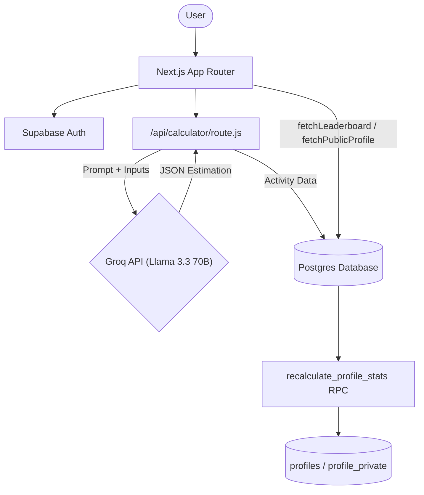
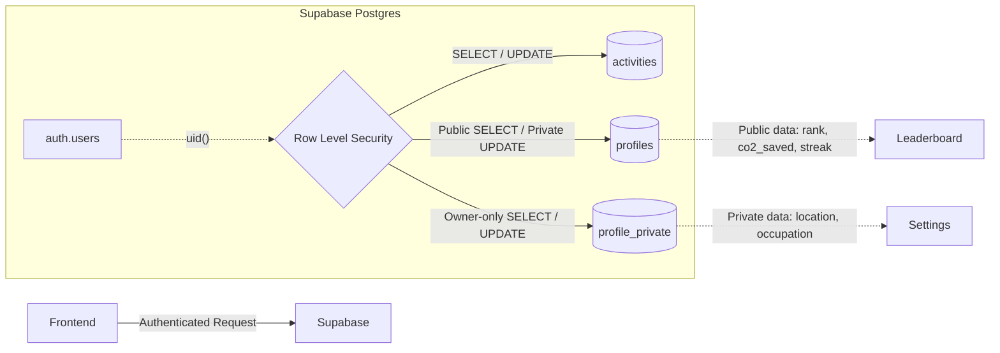

# CarbonTrace Architecture

## High-Level System Flow

## Security & RLS Boundary

The application implements a strict Row Level Security (RLS) model to prevent IDOR (Insecure Direct Object Reference) and data leaks:

## Major Workflows

### a) Authentication Flow
Users sign up/login via Supabase Auth. Upon successful authentication, Supabase issues a session token. Next.js middleware and SSR components (`createServerClient` from `@supabase/ssr`) read cookies to verify sessions on protected routes. The `uid()` is extracted to safely insert rows or fetch owner-specific data without relying on client-provided IDs.

### b) Activity Logging Flow
1. **Input:** User submits daily activities via the Next.js `EcoBot` chat interface.
2. **AI Estimation:** The `/api/calculator` route securely calls the **Groq API** (using Llama-3.3-70b-versatile) with a strict prompt forcing a JSON response. The LLM estimates CO2 emissions across 4 categories (transport, food, energy, shopping) and computes "CO2 saved" relative to high-emission baselines.
3. **Database Write:** The validated JSON data is securely logged to the `activities` table via Supabase JS client.
4. **Stats Recalculation:** The app triggers the `recalculate_profile_stats` RPC to atomically aggregate the user's historical `activities` and update their total `impact_score`, `co2_saved`, and `streak_days` on their `profiles` row.

### c) Leaderboard & Ranking Flow
The `/leaderboard` page fetches all profiles sorted by `impact_score` descending. A "dense rank" is computed on the fly so users with identical scores share the same rank. The top 3 users receive specialized visual glows. The authenticated user's specific row is identified via `supabase.auth.getUser()` and highlighted in a fixed panel if they are not in the top view.

### d) Public Profile Flow
Clicking a leaderboard row or searching via the Dashboard triggers navigation to `/profile/[id]`. The `fetchPublicProfile` method queries the `profiles` table to pull exclusively public fields (`username`, `bio`, `avatar_url`, `co2_saved`, `level`, etc.). Since sensitive data was split out, there is zero risk of over-fetching private data like location or email.

## Data Model

The application uses Supabase Postgres with the following core schema:

- **`activities` table**
  - `id` (UUID, PK)
  - `user_id` (UUID, FK to auth.users)
  - `transport_co2`, `food_co2`, `energy_co2`, `shopping_co2` (Numeric)
  - `total_co2` (Numeric)
  - `transport_input`, `food_input`, etc. (Text context of the LLM prompt)
  - *RLS: Users can only SELECT and INSERT rows matching their own `user_id`.*

- **`profiles` table** (Public)
  - `id` (UUID, PK, FK to auth.users)
  - `username`, `full_name` (Text)
  - `avatar_url`, `bio` (Text)
  - `co2_saved`, `total_co2` (Numeric)
  - `impact_score`, `level`, `streak_days` (Numeric)
  - *RLS: Anyone can SELECT (for leaderboards/profiles). Users can UPDATE their own row.*

- **`profile_private` table** (Private)
  - `id` (UUID, PK, FK to profiles.id)
  - `email`, `location`, `occupation` (Text)
  - `preferences` (JSONB)
  - *RLS: Users can only SELECT, INSERT, and UPDATE rows matching their own `id`. Completely locked down from public access.*
